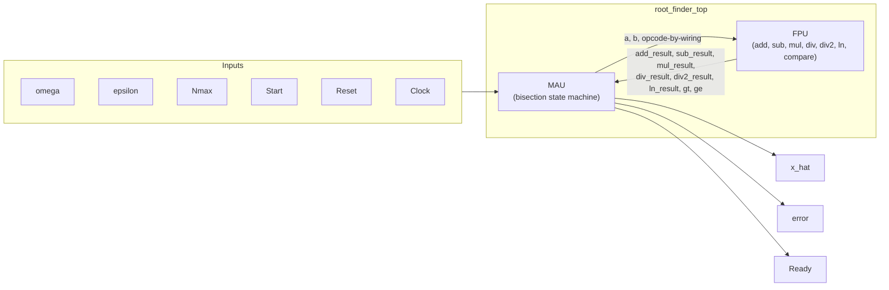
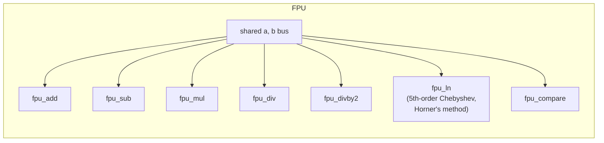
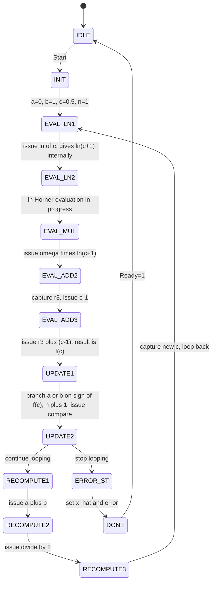
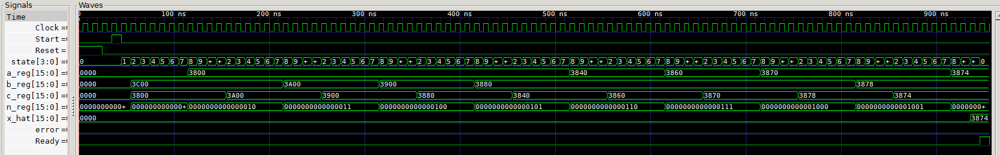
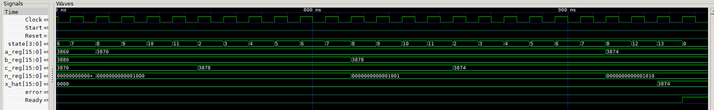

# Root-Finding IC (Bisection Method, Verilog)

A hardware implementation of the bisection root-finding method for

```
f(x) = ω·ln(x+1) + (x-1) = 0
```

built around a small shared **FPU** (floating-point arithmetic unit, IEEE-754
half-precision) and a **MAU** (Master-Algorithm-Unit) that runs the bisection
loop and consults the FPU for every arithmetic step.

## Background

This started as a university digital systems design group assignment from
2019. The original submission's FPU+MAU architecture, its IEEE-754
half-precision adder and multiplier, and the core `ln(x)` approximation were
genuine, working ideas — but the top-level integration was never finished, and
the `ln(1+x)` term, which is a **Chebyshev polynomial approximation**, had been
mislabeled as a Taylor series in later write-ups.

This repository is a corrected, fully simulated rebuild. The half-precision
format and the adder/multiplier carry over from the original; what is new is a
restoring divider, an explicit normalizer, the redesigned state machine, and
top-level integration verified end-to-end in simulation rather than assumed to
work.

## Architecture



The FPU has no opcode input. Every sub-module runs continuously off the
same shared `a`/`b` operand bus and exposes its own dedicated result
wire; the MAU (which already knows what operation it issued in which
state) just reads whichever wire is relevant that cycle. An earlier
version routed everything through a single opcode-selected `result` mux
and broke under simulation — see [Bugs found during development](#bugs-found-during-development).



## Number format

All values (`omega`, `epsilon`, `a`, `b`, `c`, `f(c)`, ...) use **IEEE-754
half-precision** (binary16): 1 sign bit, 5 exponent bits, 10 fraction bits.

```
value = (-1)^S × 1.F × 2^(E-15)
```

The leading `1.` is implicit — it is never stored, because a normalized
mantissa always has it, so the 10 stored bits buy 11 bits of significand. `E=0`
is reserved for zero (denormals are not implemented and flush to zero); `E=31`
for infinity/NaN is likewise not implemented, as bisection on a bracketed
interval never produces one.

The exponent is **biased by 15 rather than stored in two's complement**, and
that choice is what makes `fpu_compare` cheap: with sign, then exponent, then
fraction laid out in that order and the exponent unsigned, two values of the
same sign compare correctly by reading the 16-bit words as plain unsigned
integers. No unpacking needed.

Two consequences worth stating plainly:

- **Range is no longer a constraint.** The earlier fixed-point iteration of
  this design was limited to `[-2.0, +2.0)`, which was a real restriction on
  `omega`. Half-precision reaches ±65504, so it is not.
- **Precision is the accuracy floor.** 11 significant bits means values in
  `[0.5, 1)` are spaced 2⁻¹¹ ≈ 0.00049 apart. The observed root errors below
  (~0.0005) sit right at that spacing, so the design is as accurate as the
  format allows — `epsilon = 0.001` is about two units in the last place, and
  asking for much less would be asking the format for digits it does not have.

`Nmax` (the iteration cap) is a separate plain 16-bit integer. It is a loop
counter, never an arithmetic operand, so there is nothing for the FPU to do
with it.

### Arithmetic core

`src/fp16_arith.v` holds the four combinational primitives the FPU wrappers are
built on: `floatadder` (alignment, carry-out, cancellation via `norm`),
`float_multi`, `float_divi` (restoring division), and `norm` (the
leading-one normalizer used when addition cancels). The `fpu_*` modules are
thin registered wrappers around these, giving every operation a uniform
1-cycle latency (`fpu_ln` is 2).

Two of them are worth a note:

- `fpu_sub` is the adder with the second operand's sign bit inverted. Negating
  a float costs one inverter; there is no subtraction hardware.
- `fpu_divby2` does not shift the mantissa at all. Halving decrements the
  exponent and leaves sign and fraction alone, since `1.F` is still in `[1,2)`
  and needs no renormalizing.

## MAU state machine



A state *issues* an FPU operation by driving `a`/`b`; because every FPU
sub-module is individually registered, that operation's dedicated result
wire becomes valid starting the *next* state. If a result is needed only
in that very next state, it's read straight off the wire — no register
needed. If it must survive an unrelated, intervening operation (e.g.
`omega*ln(c+1)` surviving `EVAL_ADD2`'s unrelated `c-1` computation), it's
captured into a dedicated register. Only one such register (`r3`) is
needed for the entire `f(c)` evaluation chain.

The spec's literal loop condition was `while (|f(c)|>epsilon OR n<=Nmax)`
— using `OR` there is a bug (it never lets the loop stop early once
`n<=Nmax`, and can't stop at all once `n>Nmax` either, since at that
point the first term still needs to be false). The corrected condition,
used here, is `AND`.

## Waveforms

GTKWave traces from `sim/tb_waveform_demo.v` (`omega = 1.0`, `epsilon ≈ 0.001`),
showing the bracket `a_reg`/`b_reg` and the midpoint `c_reg` closing on the
root, tracked against the iteration counter `n_reg` and the state encoding:



Values are binary16 words in hex. Every `0x38xx` above has `E = 14`, so it
reads `(1 + frac/1024) × 2⁻¹`:

| word | value | word | value |
|---|---|---|---|
| `0x3800` | 0.5 | `0x3874` | 0.556640625 |
| `0x3840` | 0.53125 | `0x3878` | 0.55859375 |
| `0x3860` | 0.546875 | `0x3880` | 0.5625 |
| `0x3870` | 0.5546875 | `0x3900` | 0.625 |
| `0x3A00` | 0.75 | `0x3C00` | 1.0 |

Note `c_reg` starting at `0x3800` = 0.5 rather than the mangled `0x1E00` that
bug 4 below produced, and the bracket alternating sides — `b` down to 0.75,
0.625, 0.5625, then `a` up to 0.53125, 0.546875 — exactly as bisection should.

The closing iterations, where `x_hat` latches:



The bracket is `[0x3870, 0x3878]` = `[0.5546875, 0.55859375]` and `c_reg`
settles at `0x3874` = 0.556640625. By hand,
`f(0.556640625) = ln(1.556640625) − 0.443359375 ≈ −0.00077`, inside `epsilon`,
so `UPDATE2` exits — the state row runs `7 → 8 → 12 → 13 → 0`
(UPDATE1, UPDATE2, ERROR_ST, DONE, IDLE) — and `x_hat` takes `0x3874` with
`error = 0` and `Ready` asserted.

Every midpoint in that trace can be reproduced by hand from `f(x)` alone; the
design agrees with real arithmetic to the last bit the format carries.

## Bugs found during development

Five real bugs, none of which were visible by reading the code in isolation.

**Caught by simulating the design end-to-end:**

1. **FPU result mux** selected which sub-module's output to expose based
   on the *current* opcode — so the instant the MAU advanced to the next
   operation, the mux immediately started showing the new operation's
   result, even on the cycle still needing the previous result. Fixed by
   giving every sub-module its own dedicated, unmuxed result wire.
2. **Double `+1`**: `ln`'s polynomial already computes `ln(1+x_in)`
   internally (confirmed by hand-evaluating its coefficients at `x=0.5`
   and getting `~0.4055 = ln(1.5)`, not `ln(0.5)`). An extra adder was
   feeding it `c+1`, causing `ln(1+(c+1)) = ln(c+2)` instead of
   `ln(c+1)`. Fixed by feeding `c` directly and removing the now-redundant
   state.
3. **Multiplier truncation**: `(a*b) >>> 16` computed the product in the
   context of the narrow result register, silently truncating it *before*
   the shift — discarding exactly the bits the shift needed. Fixed with a
   wide intermediate product. (This one belongs to a fixed-point iteration
   the design passed through; the same widen-then-slice discipline is what
   `float_multi`'s 22-bit accumulator does now.)

**Caught by review, and notable because the tests passed anyway** — both are
fixed-point idioms that are silently wrong on a float, and both were survivable
because bisection is self-correcting:

4. **`c` initialised by shifting the bit pattern.** `ONE >>> 1` halves a
   fixed-point word, but on binary16 it mangles the exponent field:
   `0x3C00 >>> 1` = `0x1E00` = **0.00586**, not 0.5. The first iteration
   therefore evaluated `f` at the wrong midpoint. It converged regardless,
   because `RECOMPUTE` re-derives `c = (a+b)/2` properly from the second
   iteration on and `f(0.00586) < 0` still leaves a valid bracket. Fixed with
   an explicit `HALF = 16'h3800`.
5. **`|f(c)|` by two's-complement negation.** `-add_result` negates the whole
   word. On a float, magnitude lives in the unsigned exponent and fraction
   fields, so this is meaningless: for `f(c) ≈ -0.988` (`0xBBE9`) it yields
   `0x4417` ≈ **+4.09**. The convergence test was comparing garbage against
   `epsilon` on every iteration where `f(c)` was negative — and still
   terminated, because a bogus-large magnitude merely keeps the loop running
   until it happens to land on a *positive* small `f(c)`. Fixed by clearing
   the sign bit instead. With a working stopping test the roots came in twice
   as accurate and the run finished several states earlier.

The last two are the reason this README quotes the *stopping criterion* as well
as the answer: a root-finder that returns the right number is not the same as a
root-finder that knows when to stop.

## Simulation

Verified with [Icarus Verilog](http://iverilog.icarus.com/):

```sh
iverilog -o sim/tb.vvp src/*.v sim/tb_root_finder.v
vvp sim/tb.vvp
```

`sim/tb_root_finder.v` converts between real and binary16 in the testbench
itself (normalizing explicitly, exactly as the hardware does), checks
convergence against hand-computed roots for three different `omega` values,
and adds one deliberately under-resourced case (too few iterations) to confirm
the error-exit path itself works:

```
PASS: omega=1.000000 x_hat=0.556641 expected=0.557100 (diff=-0.000459)
PASS: omega=1.500000 x_hat=0.446289 expected=0.446500 (diff=-0.000211)
PASS: omega=0.500000 x_hat=0.726562 expected=0.727000 (diff=-0.000437)
PASS: omega=1.000000 Nmax=3 correctly reported error (did not converge in time)
---- 4 passed, 0 failed ----
```

`sim/tb_waveform_demo.v` runs the `omega=1.0` case alone and dumps a VCD for
inspection in GTKWave (`sim/waveform_demo.gtkw` is a matching signal layout):

```sh
iverilog -o sim/wf.vvp src/*.v sim/tb_waveform_demo.v
vvp sim/wf.vvp        # writes sim/waveform_demo.vcd
```

The arithmetic core has its own standalone testbench in the companion FPGA
project, covering all four primitives across 14 cases (addition, cancelling
subtraction, multiplication, division including both sign combinations, and
the normalizer's shift counts).

## Files

- `src/fp16_arith.v` — the binary16 arithmetic primitives: `floatadder`,
  `float_multi`, `float_divi`, `norm`.
- `src/fpu_add.v` — `fpu_add` and `fpu_sub` (the adder with an inverted sign
  bit).
- `src/fpu_mul.v`, `fpu_div.v`, `fpu_divby2.v`, `fpu_compare.v` — the
  remaining registered operation wrappers.
- `src/fpu_ln.v` — 5th-order Chebyshev polynomial approximation of
  `ln(1+x)`, evaluated via Horner's method as an unrolled 5-stage
  multiply-add chain (2-cycle latency).
- `src/fpu.v` — top-level FPU, wiring the above in parallel off a shared
  operand bus.
- `src/mau.v` — the bisection state machine.
- `src/root_finder_top.v` — top-level pin interface matching the
  original assignment spec (`omega, Nmax, epsilon, Start, Reset, Clock`
  in; `x_hat, error, Ready` out).
- `sim/tb_root_finder.v` — self-checking testbench.
- `sim/tb_waveform_demo.v` — single-run VCD dump for waveform inspection,
  with `sim/waveform_demo.gtkw` as its GTKWave signal layout.
- `docs/` — the waveform captures above.

`src/fp16_arith.v` is duplicated in the original Vivado FPGA project, which
compiles against its own copy; the header of each names the other. They must be
edited together — a divergence shows up as the two projects disagreeing about
arithmetic, not as a compile error.

## Credit

Originally a three-person university group project; the FPU/MAU
architecture, the half-precision adder and multiplier, and the Chebyshev
`ln(x)` approximation trace back to that submission. This repository is an
independent rebuild of the control logic and the remaining arithmetic,
corrected and verified from scratch.
